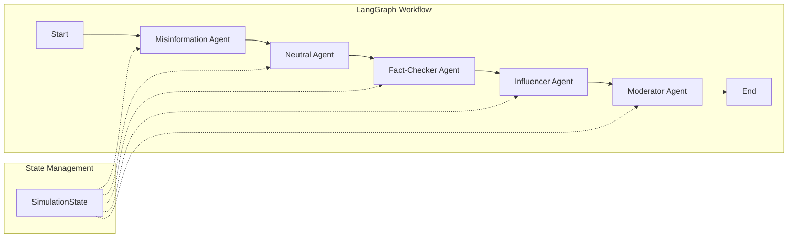

# 📖 Project Documentation

## AI Multi-Agent Misinformation Spread, Verification & Moderation System

### A Graph-Based Multi-Agent Simulation Using LangGraph and Gemini LLMs

---

## Table of Contents
  
1. [Conceptual Design](#conceptual-design)
2. [System Architecture](#system-architecture)
3. [Multi-Agent Workflow](#multi-agent-workflow)
4. [Agent Specifications](#agent-specifications)
5. [Graph-Based Network Model](#graph-based-network-model)
6. [Analytics Methodology](#analytics-methodology)
7. [Technology Stack](#technology-stack)

---

## Conceptual Design

### Problem Domain

Modern social media platforms face unprecedented challenges in controlling misinformation:

- **Rapid Spread**: False information spreads 6x faster than truth
- **Unchecked Sharing**: Users share without verification
- **Influencer Amplification**: High-reach accounts amplify misinformation
- **Scale**: Manual moderation cannot handle billions of daily posts

### Solution Approach

This system creates a **simulation environment** where autonomous AI agents interact within a synthetic social network. Each agent has a specialized role:

```
┌─────────────────────────────────────────────────────────────────┐
│                    SIMULATION ENVIRONMENT                        │
│  ┌──────────────────────────────────────────────────────────┐   │
│  │              Social Network Graph (NetworkX)              │   │
│  │                    15 nodes, BA model                     │   │
│  └──────────────────────────────────────────────────────────┘   │
│                              ↓                                   │
│  ┌──────────┐   ┌──────────┐   ┌──────────┐   ┌──────────┐     │
│  │ Misinfo  │ → │ Neutral  │ → │ Fact-    │ → │Influencer│     │
│  │  Agent   │   │  Agent   │   │ Checker  │   │  Agent   │     │
│  └──────────┘   └──────────┘   └──────────┘   └──────────┘     │
│                                       ↓                         │
│                              ┌──────────────┐                   │
│                              │  Moderator   │                   │
│                              │    Agent     │                   │
│                              └──────────────┘                   │
└─────────────────────────────────────────────────────────────────┘
```

---

## System Architecture

### Layered Architecture

```
┌────────────────────────────────────────────────────────────┐
│                   PRESENTATION LAYER                        │
│                    (Streamlit UI)                           │
├────────────────────────────────────────────────────────────┤
│                  ORCHESTRATION LAYER                        │
│                     (LangGraph)                             │
├────────────────────────────────────────────────────────────┤
│                    AGENT LAYER                              │
│  Misinformation │ Neutral │ Fact-Checker │ Influencer │ Mod│
├────────────────────────────────────────────────────────────┤
│                   GRAPH LAYER                               │
│             (NetworkX Social Network)                       │
├────────────────────────────────────────────────────────────┤
│                  ANALYTICS LAYER                            │
│              (Metrics & Reporting)                          │
├────────────────────────────────────────────────────────────┤
│                    LLM LAYER                                │
│                  (Gemini API)                               │
└────────────────────────────────────────────────────────────┘
```

---

## Multi-Agent Workflow

### Sequential Pipeline (LangGraph Orchestration)



### Workflow Steps

| Step | Agent | Input | Process | Output |
|------|-------|-------|---------|--------|
| 1 | Misinformation | Prompt | LLM generates plausible claim | Claim text |
| 2 | Neutral | Claim + Graph | BFS traversal simulation | Spread path, nodes reached |
| 3 | Fact-Checker | Claim | LLM analysis + simulated search | Verdict (Real/Fake/Unverified) |
| 4 | Influencer | Claim + Verdict | Conditional prompt engineering | Rewritten content |
| 5 | Moderator | Content + Verdict | Policy-based decision | Action (Flag/Review/Allow) |

---

## Agent Specifications

### 1. Misinformation Agent

**Purpose**: Generates realistic fake news claims

**Technology**: Gemini LLM with creative prompting

**Prompt Strategy**:
```
Generate a short, news-like claim that sounds plausible 
but may be real or fake. Topics: current events, technology, 
health, or politics. Under 2 sentences. No disclaimers.
```

**Output**: Claim dictionary with text and metadata

---

### 2. Neutral Agent

**Purpose**: Simulates typical users sharing without verification

**Technology**: NetworkX graph + BFS algorithm

**Algorithm**:
```
BFS_SPREAD(graph, start_node, max_depth):
    queue = [(start_node, 0)]
    visited = {start_node}
    spread_path = []
    
    while queue not empty:
        node, depth = queue.pop(0)
        if depth > max_depth: continue
        
        spread_path.append(node)
        mark node as infected
        
        for neighbor in graph.neighbors(node):
            if neighbor not in visited:
                visited.add(neighbor)
                queue.append((neighbor, depth + 1))
    
    return spread_path
```

**Metrics Calculated**:
- Spread velocity (nodes/time step)
- Infection timeline (node → timestamp)

---

### 3. Fact-Checker Agent

**Purpose**: Verifies claims and renders verdicts

**Technology**: Gemini LLM with structured output parsing

**Verification Process**:
1. Receive claim from previous agent
2. Simulate web search (tool calling)
3. Use LLM to analyze claim against "evidence"
4. Extract verdict: Real | Fake | Unverified
5. Generate evidence summary

**Prompt Structure**:
```
You are a fact-checking AI. Analyze the claim:
"{claim}"

Determine if it is Real, Fake, or Unverified.
Format: VERDICT: [verdict] | EVIDENCE: [explanation]
```

---

### 4. Influencer Agent

**Purpose**: Maximizes viral potential or warns about misinformation

**Technology**: Gemini LLM with conditional prompting

**Decision Logic**:
```
IF verdict == "Fake":
    prompt = WARNING_TEMPLATE  # Alert users
    action = "warning"
ELIF verdict == "Real":
    prompt = VIRAL_TEMPLATE    # Optimize spread
    action = "amplify"
ELSE:
    prompt = DISCLAIMER_TEMPLATE  # Add uncertainty
    action = "disclaimer"
```

**Amplification Scoring**:
- Amplify: 8/10 (high viral potential)
- Warning: 6/10 (moderate reach)
- Disclaimer: 4/10 (reduced reach)

---

### 5. Moderator Agent

**Purpose**: Makes content moderation decisions

**Technology**: Rule-based policy + LLM reasoning

**Policy Matrix**:

| Verdict | Decision | Containment | Spread Allowed |
|---------|----------|-------------|----------------|
| Fake | 🚫 Flag & Stop | 100% | No |
| Unverified | ⚠️ Mark for Review | 50% | Yes (reduced) |
| Real | ✅ Allow | 0% | Yes |

---

## Graph-Based Network Model

### Barabási-Albert Model

The social network uses the **Barabási-Albert preferential attachment model**, which generates scale-free networks similar to real social platforms:

**Properties**:
- Some nodes (influencers) have many connections
- Most nodes have few connections
- "Rich get richer" - well-connected nodes attract more connections

**Parameters**:
- `n = 15`: Total nodes in network
- `m = 2`: Edges added per new node

### Node Attributes

```python
{
    'infected': bool,        # Has received misinformation
    'infection_time': int,   # When infected (-1 if not)
    'is_influencer': bool    # Degree >= 5
}
```

### Visualization Color Coding

| Node State | Color |
|------------|-------|
| Uninfected | Green 🟢 |
| Infected | Red 🔴 |
| Influencer (infected) | Gold 🟡 |
| Starting node | Blue border 🔵 |

---

## Analytics Methodology

### 1. Spread Velocity Analysis

**Formula**: `velocity = nodes_reached / time_steps`

**Interpretation**:
- High velocity → Rapid misinformation spread
- BFS levels represent time steps

### 2. Network Penetration Rate

**Formula**: `penetration = (nodes_reached / total_nodes) × 100%`

**Example**: 5/15 nodes = 33.3% penetration

### 3. Verification Impact Scoring

| Verdict | Impact Score | Description |
|---------|--------------|-------------|
| Fake | 10 | High impact - spread halted |
| Unverified | 5 | Medium impact - visibility reduced |
| Real | 0 | No containment needed |

### 4. Agent Influence Ranking

Each agent contributes to the overall information dynamics:

- **Misinformation Agent**: Creates initial content (baseline = 5)
- **Neutral Agent**: Enables spreading (score = nodes_reached)
- **Fact-Checker Agent**: Reduces spread (score = impact_score)
- **Influencer Agent**: Amplifies reach (score = amplification_score)
- **Moderator Agent**: Enforces containment (score = containment_rate)

### 5. Moderation Effectiveness

**Metrics**:
- Containment Rate: % of potential spread prevented
- Nodes Protected: Absolute count of protected users
- Decision Accuracy: Correct application of policy

---

## Technology Stack

| Component | Technology | Purpose |
|-----------|------------|---------|
| Language | Python 3.9+ | Core development |
| LLM | Gemini 1.5 Flash | Claim generation, verification, rewriting |
| Orchestration | LangGraph | Multi-agent coordination |
| Graph Library | NetworkX | Social network modeling |
| Visualization | Matplotlib | Network rendering |
| UI Framework | Streamlit | Interactive web interface |
| Environment | python-dotenv | Configuration management |

---

## Workflow Diagram Summary

```
┌──────────────────────────────────────────────────────────────┐
│                      USER INTERFACE                           │
│                       (Streamlit)                             │
└──────────────────────────┬───────────────────────────────────┘
                           │
                           ▼
┌──────────────────────────────────────────────────────────────┐
│                    LANGGRAPH WORKFLOW                         │
│                                                               │
│   ┌─────────┐    ┌─────────┐    ┌─────────┐    ┌─────────┐  │
│   │ MISINFO │ →  │ NEUTRAL │ →  │FACTCHECK│ →  │INFLUENCR│  │
│   │  AGENT  │    │  AGENT  │    │  AGENT  │    │  AGENT  │  │
│   └─────────┘    └─────────┘    └─────────┘    └─────────┘  │
│        │              │              │              │        │
│        ▼              ▼              ▼              ▼        │
│   ┌─────────┐    ┌─────────┐    ┌─────────┐    ┌─────────┐  │
│   │ Gemini  │    │NetworkX │    │ Gemini  │    │ Gemini  │  │
│   │   API   │    │  Graph  │    │   API   │    │   API   │  │
│   └─────────┘    └─────────┘    └─────────┘    └─────────┘  │
│                                                               │
│                           │                                   │
│                           ▼                                   │
│                    ┌───────────┐                             │
│                    │ MODERATOR │                             │
│                    │   AGENT   │                             │
│                    └───────────┘                             │
│                           │                                   │
│                           ▼                                   │
│                    ┌───────────┐                             │
│                    │ ANALYTICS │                             │
│                    │  METRICS  │                             │
│                    └───────────┘                             │
└──────────────────────────────────────────────────────────────┘
```

---

## References

- LangGraph Documentation: https://python.langchain.com/docs/langgraph
- NetworkX: https://networkx.org/
- Gemini API: https://ai.google.dev/
- Barabási-Albert Model: https://en.wikipedia.org/wiki/Barabási–Albert_model